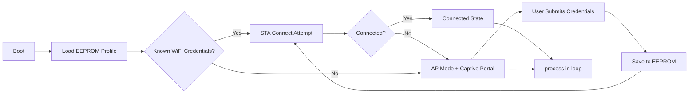
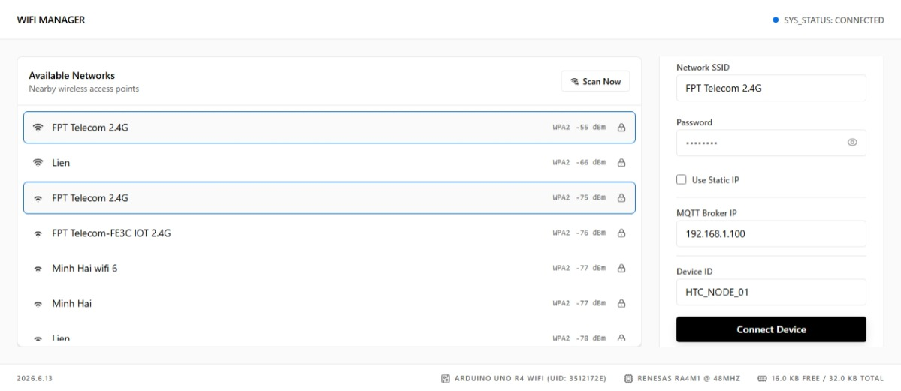
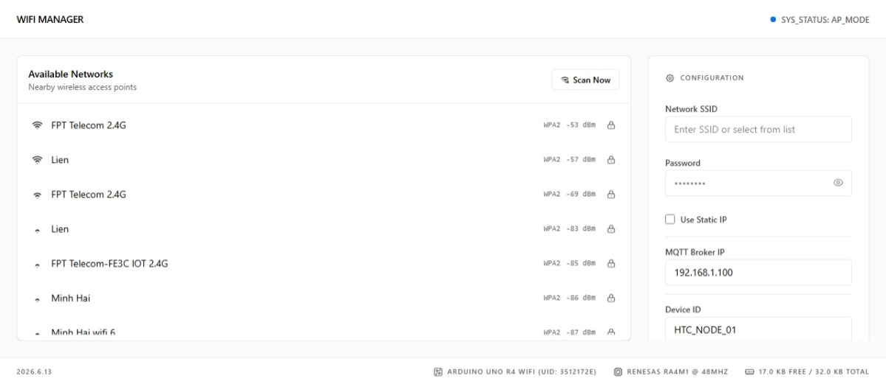
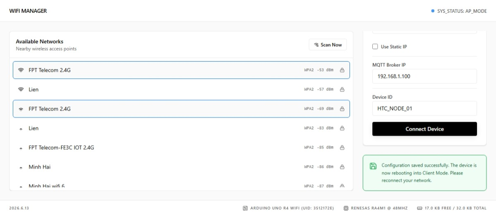

# HiTECH R4 WiFi Manager

[](#hardware-compatibility)
[](#architecture)
[](LICENSE)
[](#api-reference)

**HiTECH R4 WiFi Manager** eliminates hardcoded credentials with a modern captive portal, while keeping `loop()` responsive through a non-blocking finite-state architecture powered by native `WiFiS3` and Renesas APIs.

## Table of Contents

- [Why This Library](#why-this-library)
- [Features](#features)
- [Architecture](#architecture)
- [Hardware Compatibility](#hardware-compatibility)
- [Installation](#installation)
- [Quick Start](#quick-start)
- [API Reference](#api-reference)
- [HTTP API Usage](#http-api-usage)
- [Troubleshooting](#troubleshooting)
- [FAQ](#faq)
- [Screenshots](#screenshots)
- [Examples](#examples)
- [Contributing](#contributing)
- [Changelog](#changelog)
- [License](#license)

## Why This Library

Many embedded WiFi onboarding solutions block the main control loop, making them risky for real-time workloads.

This project is designed to:

- Keep your firmware responsive during AP/STA transitions,
- Avoid heap fragmentation during JSON-heavy portal operations,
- Provide production-friendly runtime configuration without recompiling credentials.

## Features

- **Asynchronous state machine (FSM)**: Handles first connect, reconnect, and DHCP flow with zero `delay()` dependency.
- **Non-blocking HTTP handling**: Client processing is buffered and event-driven to avoid lockups.
- **Memory-fragmentation mitigation**: Uses `String::reserve()` in critical paths to stabilize heap behavior.
- **Hardware-level telemetry**: Exposes board-level details such as free SRAM and unique device identity.
- **Embedded SPA captive portal**: Lightweight, modern UI with custom runtime parameters.
- **Custom fields and persistent config**: Parameterized form inputs (for example MQTT host, node ID) are stored in EEPROM.
- **Credential obfuscation**: EEPROM payload uses XOR obfuscation to avoid plain-text storage.

## Architecture



### Runtime States

- `STATUS_IDLE`
- `STATUS_AP_MODE`
- `STATUS_CONNECTING`
- `STATUS_CONNECTED`
- `STATUS_RECONNECTING`

## Hardware Compatibility

Supported target:

- **Arduino Uno R4 WiFi** (Renesas RA4M1 + ESP32-S3 module)

Not supported:

- AVR-based boards
- ESP8266 boards
- Generic ESP32 boards

## Installation

### Arduino IDE Library Manager

1. Open Arduino IDE.
2. Navigate to **Sketch > Include Library > Manage Libraries...**
3. Search for **HiTECH R4 WiFi Manager**.
4. Install the latest release.

### Manual Installation

1. Go to **Github Repository**, click on **Code > Local > Download ZIP**.
2. In Arduino IDE, open **Sketch > Include Library > Add .ZIP Library...**
3. Select the downloaded ZIP file.

## Quick Start

```cpp
#include <WiFiManager.h>

WiFiManager wifiManager;

void setup() {
    Serial.begin(115200);
    while (!Serial) {}

    wifiManager.addParameter("mqtt_server", "MQTT Broker IP", "192.168.1.100");
    wifiManager.addParameter("device_id", "Device ID", "HTC_NODE_01");

    bool connected = wifiManager.autoConnect("HiTECH_Config_AP");

    if (connected) {
        Serial.print("IP: ");
        Serial.println(WiFi.localIP());
        Serial.println(wifiManager.getParameter("mqtt_server"));
        Serial.println(wifiManager.getParameter("device_id"));
    }
}

void loop() {
    wifiManager.process();
}
```

## API Reference

### Core Lifecycle

| Method | Description |
| --- | --- |
| `WiFiManager()` | Creates an instance with default settings. |
| `bool autoConnect(const char* apName = "HiTECH_AP", const char* apPassword = nullptr)` | Tries saved credentials first, then falls back to AP portal when needed. |
| `void process()` | Runs asynchronous networking and HTTP handling; call continuously from `loop()`. |
| `void resetSettings()` | Clears stored credentials and custom parameters from EEPROM. |

### Network and Server

| Method | Description |
| --- | --- |
| `void setPort(uint16_t port)` | Sets HTTP server port (default: `80`). |
| `void setKeepServerAlive(bool keepAlive)` | Keeps server active after connection for local management endpoints. |
| `String getConnectionStatusJSON()` | Returns JSON payload describing current connection state. |
| `SystemStatus getStatus()` | Returns internal FSM status enum. |

### Captive Portal Customization

| Method | Description |
| --- | --- |
| `void setCustomHTML(const char* html)` | Injects custom HTML into the portal page. |
| `void addParameter(const char* id, const char* label, const char* defaultValue)` | Adds custom portal input (maximum 5 entries). |
| `String getParameter(const char* id)` | Reads back stored custom parameter value. |

### Callbacks

| Method | Description |
| --- | --- |
| `void setAPCallback(WiFiManagerCallback callback)` | Triggered when AP mode starts. |
| `void setConnectCallback(WiFiManagerCallback callback)` | Triggered after successful STA connection. |
| `void setSaveCallback(WiFiManagerCallback callback)` | Triggered when credentials are saved from the portal. |

## HTTP API Usage

This library exposes local HTTP endpoints used by the captive portal frontend.

Important notes:

- Default server port is `80` (changeable via `setPort(...)`).
- Endpoints are available when the internal server is running:
    - always in AP mode,
    - in connected mode only if `setKeepServerAlive(true)` (default behavior).
- Request body for `POST /api/connect` is form-style (`application/x-www-form-urlencoded`), not JSON.
- There is currently no authentication layer on these endpoints. Use only in trusted local network contexts.

### Base URL

- AP mode: `http://192.168.4.1`
- Custom port example: `http://192.168.4.1:8080`

### Endpoint Matrix

| Method | Path | Description | Params | Example Endpoint | Example Request | Example Response |
| --- | --- | --- | --- | --- | --- | --- |
| `GET` | `/api/scan` | Returns visible WiFi networks as JSON array. | None | `http://192.168.4.1/api/scan` | None | `[ {"ssid":"MyWiFi","rssi":-51,"encryption":"WPA2"} ]` |
| `GET` | `/api/status` | Returns current connection status JSON. | None | `http://192.168.4.1/api/status` | None | `{"status":"CONNECTED","ip":"192.168.1.50","ssid":"OfficeWiFi"}` |
| `GET` | `/api/info` | Returns board/system information JSON. | None | `http://192.168.4.1/api/info` | None | `{"board":"Arduino UNO R4 WiFi (UID: ABCD1234)","cpu":"Renesas RA4M1 @ 48MHz","ram":"22.4 KB Free / 32.0 KB Total","wifi_fw":"0.4.1"}` |
| `GET` | `/api/params` | Returns configured custom portal parameters. | None | `http://192.168.4.1/api/params` | None | `[ {"id":"mqtt_server","label":"MQTT Broker IP","value":"192.168.1.100"} ]` |
| `POST` | `/api/connect` | Saves WiFi credentials and custom values, then schedules reboot. | Required: `ssid`.<br>Optional: `password`, `useStatic`, `ip`, `gw`, `sn`, `dns`, plus custom fields from `addParameter(...)`. | `http://192.168.4.1/api/connect` | `ssid=MyWiFi&password=secret123&useStatic=false&mqtt_server=192.168.1.100&device_id=HTC_NODE_01` | Success: `{"status":"success","message":"Credentials saved. Device will now reboot."}`<br>Error: `{"status":"error","message":"Missing SSID."}` |
| `POST` | `/api/reset` | Clears saved settings, then schedules reboot. | None | `http://192.168.4.1/api/reset` | Empty body | `{"status":"success","message":"Settings cleared."}` |

`POST /api/connect` and `POST /api/reset` both trigger a delayed device reboot after responding.

## Troubleshooting

### Captive portal does not appear

- Confirm you are testing on Arduino Uno R4 WiFi.
- Verify board package and USB serial monitor are configured correctly.
- Ensure previous credentials are cleared with `resetSettings()` when changing test environments.

### Device stays in reconnect loop

- Check router compatibility (2.4 GHz network availability and WPA settings).
- Confirm SSID/password values entered in the portal.
- Print `getConnectionStatusJSON()` to serial for status-level diagnostics.

### Configuration values not saved

- Keep parameter IDs under expected internal limits.
- Avoid resetting power during save operations.
- Verify EEPROM is writable in your current board setup.

## FAQ

### Does this library block `loop()`?

No. The library is designed around a non-blocking process model. You must call `process()` repeatedly from `loop()`.

### Can I use this on ESP32 or ESP8266?

No. This implementation is targeted specifically at Arduino Uno R4 WiFi.

### Can I customize the captive portal page?

Yes. Use `setCustomHTML()` for custom portal fragments and `addParameter()` for runtime fields.

## Screenshots





## Examples

- [BasicAutoConnect](examples/BasicAutoConnect/BasicAutoConnect.ino)

## Contributing

Contributions are welcome. Please review the contribution guidelines before submitting pull requests.

- [Contributing Guide](CONTRIBUTING.md)

## Changelog

Release history and notable changes are tracked in:

- [CHANGELOG.md](CHANGELOG.md)

## License

Distributed under the MIT License.

See [LICENSE](LICENSE) for full text.
